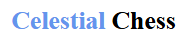
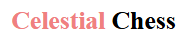
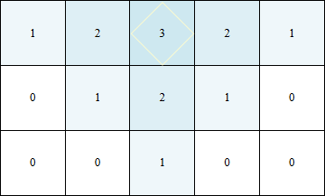
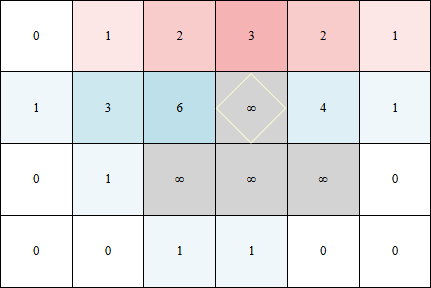
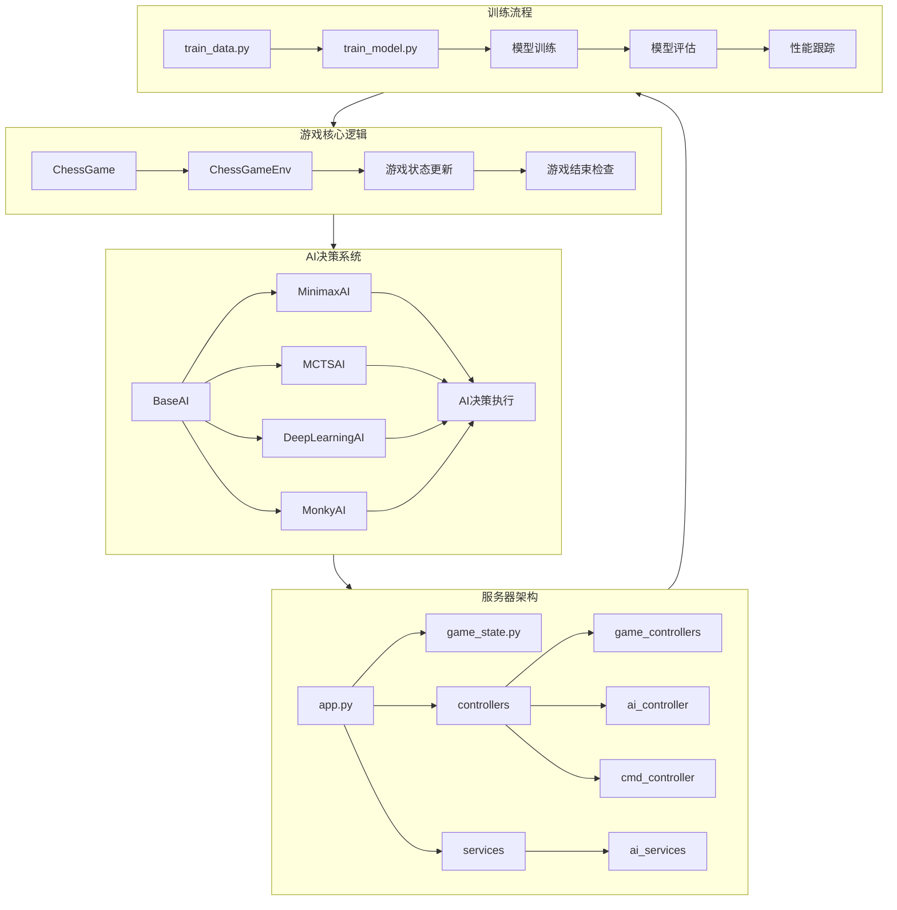

# Celestial Chess

## 游戏名称

**Celestial Chess**

## 游戏目标

在棋盘上通过策略性地摆放棋子，以达到获得最高总分的目的。

## 棋盘和棋子

- 使用AxA的棋盘。
  - 例如5x5 8x8 11x11
- 两位玩家，分别为蓝方和红方。
  - 两者可以通过标题中**Celestial**的颜色来区分
  - 
  - 

## 游戏规则

1. **轮流落子**：玩家轮流在棋盘上的空格，也就是分数为0的点落子。
2. **分数影响**：
   - 每个格子初始数字为0。
   - 每次落子都会影响周围的格子，使其上数字变化。
   - 黑白方有各自的变化系数，默认蓝方为1，红方为-1。
     - 蓝方落子时分数增加，红方落子时分数减少。
   - 落子点的分数设为X。
     - 一般为2/3/5
   - 落子点的左侧、右侧和下方的格子，其与落子点间的方格距离为L，则其变化绝对值为max(X-L, 0)。
     - 例如X为3，则红方落子点下方的格子变化绝对值为3-2=1，变化值为1*(-1)=-1。
     - 与落子点距离太远的话变化值为0，也就是格子不受影响。
     - 如下图所示，落子点周围除上方外，所有点均受范围性影响，与落子点越远受影响越小。
     - 
3. **黑洞点**：
   - 如果任何格子的分数（绝对值）达到或超过2X+3，该格子变成黑洞点。
   - 黑洞产生点周围的点也会成为黑洞点，与落子不同，呈反向扩散趋势，影响距离为X-1。
     - 如下图，黑洞产生点为第二行第四列，除这一点外其下方的点也扩散性变为黑洞点，
     - 
   - 黑洞点阻止其周围的分数传播。
     - 也就是在深度搜索中，黑洞点不纳入搜索阵列。
4. **游戏结束**：当玩家无法继续落子时，游戏结束。

## 胜利条件

- 游戏有一套有点复杂的分数计算机制。
- 游戏结束时，最终得分为正时蓝方获胜，得分为负时红方获胜。

## 策略提示

- 玩家需要在攻击对手和增加自己得分之间找到平衡。
- 策略性地使用黑洞点可以改变游戏局势。
- 预测对手的可能动作并计算每一步的长远影响非常重要。
- 棋盘不同位置的价值各有不同。

## 架构图

